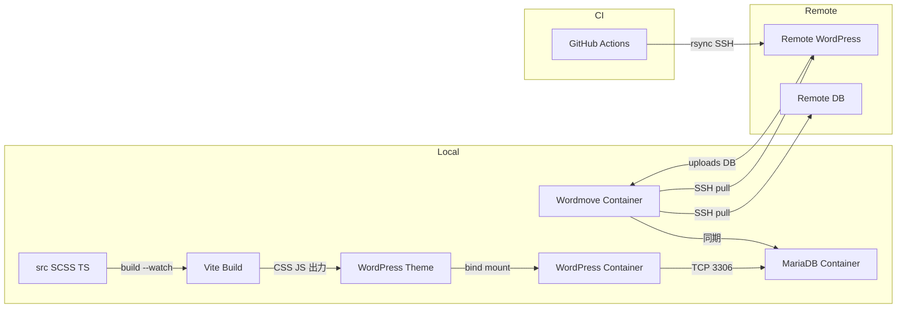
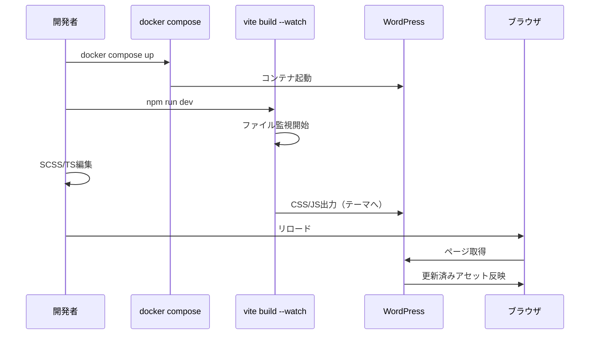
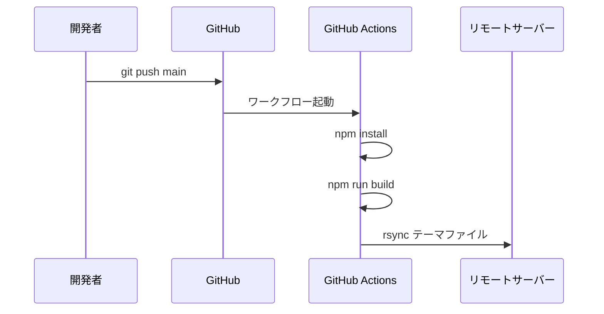

# Design Document: wp-dev-environment

## Overview

**Purpose**: Docker Compose、Vite、Wordmove、GitHub Actionsを統合したWordPress開発環境を提供し、ローカル開発からデプロイまでのワークフローをシンプルに標準化する。

**Users**: WordPress テーマ開発者がローカル開発、フロントエンドビルド、コンテンツ同期、自動デプロイに利用する。

### Goals
- ワンコマンドでローカルWordPress環境の起動・停止が可能
- SCSS/TSの変更がWordPressテーマへ即時反映される開発体験
- リモート環境のDB・uploadsをローカルへ安全に同期
- GitHub Actionsによる自動デプロイの標準化
- 設定ファイル最小限のシンプル構成

### Non-Goals
- Vite Dev ServerによるHMR（Hot Module Replacement）対応
- Wordmoveによるリモートへのpush/deploy
- マルチサイト対応
- プラグイン開発環境（テーマ開発のみ対象）
- ステージング・本番の複数環境分岐（単一環境構成）

## Architecture

### Architecture Pattern & Boundary Map



**Architecture Integration**:
- **選定パターン**: フラット構成 — ルートに設定ファイル群、src/にソース、wp-content/themes/にテーマ。シンプル最優先の要件に合致
- **ドメイン境界**: ビルド（Vite）、実行環境（Docker Compose）、同期（Wordmove）、デプロイ（GitHub Actions）の4領域を独立管理
- **新コンポーネント根拠**: 各ツールが単一責務を持ち、npm scriptsで統合

### Technology Stack

| Layer | Choice / Version | Role in Feature | Notes |
|-------|------------------|-----------------|-------|
| Frontend Build | Vite ^6.x, sass ^1.70, TypeScript ^5.8 | SCSS/TSのコンパイルとwatch | build --watchモードで運用 |
| Runtime | WordPress php8.3-apache | WordPressアプリケーション実行 | 公式Dockerイメージ |
| Data | MariaDB 11 | WordPressデータベース | ARM64互換性良好 |
| Sync | Wordmove (welaika/wordmove) | リモートDB・uploads同期 | Dockerイメージで実行 |
| CI/CD | GitHub Actions | テーマ自動デプロイ | rsync over SSH |
| Infrastructure | Docker Compose | コンテナオーケストレーション | 単一docker-compose.yml |

## System Flows

### 開発ワークフロー



### デプロイフロー



## Requirements Traceability

| Requirement | Summary | Components | Interfaces | Flows |
|-------------|---------|------------|------------|-------|
| 1.1 | docker compose upでWP+DB起動 | DockerCompose | docker-compose.yml | 開発ワークフロー |
| 1.2 | docker compose downで停止 | DockerCompose | docker-compose.yml | — |
| 1.3 | DBデータ永続化 | DockerCompose | named volume | — |
| 1.4 | テーマディレクトリマウント | DockerCompose | bind mount | 開発ワークフロー |
| 1.5 | 単一docker-compose.yml | DockerCompose | — | — |
| 2.1 | SCSS変更検知・コンパイル | ViteBuild | vite.config.ts | 開発ワークフロー |
| 2.2 | TS変更検知・コンパイル | ViteBuild | vite.config.ts | 開発ワークフロー |
| 2.3 | ビルド済みアセット出力 | ViteBuild | rollupOptions | 開発ワークフロー |
| 2.4 | 本番ビルド | ViteBuild | npm run build | デプロイフロー |
| 2.5 | vite.config.ts単一設定 | ViteBuild | — | — |
| 3.1 | リモートDB同期 | WordmoveSync | Movefile.yml | — |
| 3.2 | リモートuploads同期 | WordmoveSync | Movefile.yml | — |
| 3.3 | 環境変数で機密情報管理 | WordmoveSync, EnvConfig | .env, Movefile.yml | — |
| 3.4 | push制限 | WordmoveSync | Movefile.yml forbid | — |
| 4.1 | push時自動デプロイ | DeployPipeline | workflow YAML | デプロイフロー |
| 4.2 | テーマ・アセット転送 | DeployPipeline | rsync | デプロイフロー |
| 4.3 | GitHub Secrets管理 | DeployPipeline | GitHub Secrets | — |
| 4.4 | 単一YAMLワークフロー | DeployPipeline | — | — |
| 5.1 | ルートに設定ファイル配置 | ProjectStructure | — | — |
| 5.2 | .envで環境設定管理 | EnvConfig | .env, .gitignore | — |
| 5.3 | ディレクトリ分離 | ProjectStructure | — | — |
| 5.4 | npm scripts集約 | ProjectStructure | package.json scripts | — |

## Components and Interfaces

| Component | Domain/Layer | Intent | Req Coverage | Key Dependencies | Contracts |
|-----------|-------------|--------|--------------|-----------------|-----------|
| DockerCompose | Infrastructure | WP+DBコンテナ管理 | 1.1-1.5 | Docker Engine (P0) | Service |
| ViteBuild | Frontend Build | SCSS/TSビルド・watch | 2.1-2.5 | Node.js (P0), sass (P0) | Service |
| WordmoveSync | Sync | リモートからのpull同期 | 3.1-3.4 | Docker Engine (P0), SSH (P0) | Service |
| DeployPipeline | CI/CD | 自動デプロイ | 4.1-4.4 | GitHub Actions (P0), rsync (P0) | Service |
| ProjectStructure | Project | ディレクトリ構成・DX | 5.1-5.4 | — | — |
| EnvConfig | Config | 環境変数管理 | 3.3, 5.2 | — | — |

### Infrastructure

#### DockerCompose

| Field | Detail |
|-------|--------|
| Intent | Docker ComposeでWordPressとMariaDBを管理し、ローカル開発環境を提供する |
| Requirements | 1.1, 1.2, 1.3, 1.4, 1.5 |

**Responsibilities & Constraints**
- WordPressコンテナ（php8.3-apache）とMariaDBコンテナの起動・停止
- named volumeによるDBデータ永続化
- テーマディレクトリのバインドマウント（ホスト→コンテナ）
- 単一 `docker-compose.yml` で完結

**Dependencies**
- External: Docker Engine — コンテナ実行基盤 (P0)
- External: wordpress:php8.3-apache — WordPressイメージ (P0)
- External: mariadb:11 — データベースイメージ (P0)

**Contracts**: Service [x]

##### Service Interface

```yaml
# docker-compose.yml サービス定義
services:
  wordpress:
    image: "wordpress:php8.3-apache"
    ports: ["8080:80"]
    volumes:
      - "./wordpress/wp-content/themes/<theme-name>:/var/www/html/wp-content/themes/<theme-name>"
    environment:
      WORDPRESS_DB_HOST: "db"
      WORDPRESS_DB_USER: "${DB_USER}"
      WORDPRESS_DB_PASSWORD: "${DB_PASSWORD}"
      WORDPRESS_DB_NAME: "${DB_NAME}"
    depends_on: [db]

  db:
    image: "mariadb:11"
    volumes:
      - "db_data:/var/lib/mysql"
    environment:
      MYSQL_ROOT_PASSWORD: "${DB_ROOT_PASSWORD}"
      MYSQL_DATABASE: "${DB_NAME}"
      MYSQL_USER: "${DB_USER}"
      MYSQL_PASSWORD: "${DB_PASSWORD}"

volumes:
  db_data:
```

- Preconditions: Docker Engineが起動していること
- Postconditions: WordPressが `http://localhost:8080` でアクセス可能
- Invariants: DBデータはコンテナ再作成後も保持される

**Implementation Notes**
- ポートは8080を使用（80はホスト側で競合の可能性）
- テーマ名は変数化せず、プロジェクト固有値として直接記述
- `.env` ファイルからDB認証情報を読み込み

#### ViteBuild

| Field | Detail |
|-------|--------|
| Intent | SCSS/TypeScriptをビルドし、WordPressテーマのアセットディレクトリへ出力する |
| Requirements | 2.1, 2.2, 2.3, 2.4, 2.5 |

**Responsibilities & Constraints**
- `vite build --watch` でSCSS/TSファイルの変更を検知
- CSSとJSをテーマの `assets/` ディレクトリへ出力
- 本番ビルド時はミニファイを適用
- `vite.config.ts` 単一ファイルで設定完結

**Dependencies**
- External: vite ^6.x — ビルドツール (P0)
- External: sass ^1.70 — SCSSコンパイラ (P0)
- External: typescript ^5.8 — TypeScriptコンパイラ (P0)

**Contracts**: Service [x]

##### Service Interface

```typescript
// vite.config.ts の設計仕様
import { defineConfig } from "vite";
import { resolve } from "path";

interface ViteBuildConfig {
  // エントリポイント
  input: {
    style: string;  // src/scss/style.scss
    main: string;   // src/ts/main.ts
  };
  // 出力先: WordPressテーマのassetsディレクトリ
  outDir: string;  // wordpress/wp-content/themes/<theme-name>/assets
  // Watch時の空ディレクトリ削除を無効化
  emptyOutDir: boolean;  // false（watchモード時）
}
```

- Preconditions: Node.jsがインストール済み、npm installが完了していること
- Postconditions: テーマの `assets/` にCSS/JSファイルが出力される
- Invariants: ソースファイルの変更がビルド出力に反映される

**Implementation Notes**
- `rollupOptions.input` で複数エントリポイントを定義（ライブラリモードは使用しない）
- `rollupOptions.output.entryFileNames` / `assetFileNames` でファイル名を固定化（ハッシュなし、WordPressのエンキューと整合させるため）
- `css.preprocessorOptions.scss.additionalData` でグローバル変数の注入が可能

### Sync

#### WordmoveSync

| Field | Detail |
|-------|--------|
| Intent | Wordmove Dockerイメージでリモート環境のDB・uploadsをローカルへpull同期する |
| Requirements | 3.1, 3.2, 3.3, 3.4 |

**Responsibilities & Constraints**
- `welaika/wordmove` Dockerイメージで実行
- pull操作のみ（DB、uploads）
- push操作はforbidセクションで制限
- SSH公開鍵認証でリモート接続

**Dependencies**
- External: welaika/wordmove — Wordmove Dockerイメージ (P0)
- External: SSH — リモートサーバー接続 (P0)
- Inbound: EnvConfig — 接続情報の環境変数 (P0)

**Contracts**: Service [x]

##### Service Interface

```yaml
# Movefile.yml 設計仕様
global:
  sql_adapter: "wpcli"

local:
  vhost: "http://localhost:8080"
  wordpress_path: "./wordpress"
  database:
    name: "<%= ENV['DB_NAME'] %>"
    user: "<%= ENV['DB_USER'] %>"
    password: "<%= ENV['DB_PASSWORD'] %>"
    host: "db"
    port: "3306"

production:
  vhost: "<%= ENV['REMOTE_URL'] %>"
  wordpress_path: "<%= ENV['REMOTE_WP_PATH'] %>"
  database:
    name: "<%= ENV['REMOTE_DB_NAME'] %>"
    user: "<%= ENV['REMOTE_DB_USER'] %>"
    password: "<%= ENV['REMOTE_DB_PASSWORD'] %>"
    host: "<%= ENV['REMOTE_DB_HOST'] %>"
  ssh:
    host: "<%= ENV['REMOTE_SSH_HOST'] %>"
    user: "<%= ENV['REMOTE_SSH_USER'] %>"
    port: "<%= ENV['REMOTE_SSH_PORT'] %>"
  forbid:
    push:
      db: true
      uploads: true
      themes: true
      plugins: true
      languages: true
      mu_plugins: true
```

- Preconditions: Docker起動済み、SSH鍵設定済み、.envに接続情報記載済み
- Postconditions: ローカルDBとuploadsがリモートと同期される
- Invariants: push操作は常に禁止される

**Implementation Notes**
- npm scriptで `docker run` コマンドをラップし、ボリュームマウント（Movefile.yml, .env, SSH鍵, wordpress/）を自動設定
- Wordmoveコンテナからローカルのdocker compose DBへの接続には、Dockerネットワーク共有が必要

### CI/CD

#### DeployPipeline

| Field | Detail |
|-------|--------|
| Intent | GitHub Actionsでmainブランチへのpush時にテーマをリモートサーバーへ自動デプロイする |
| Requirements | 4.1, 4.2, 4.3, 4.4 |

**Responsibilities & Constraints**
- mainブランチへのpushをトリガーに自動実行
- Node.jsビルド（npm install → npm run build）後にrsyncで転送
- 認証情報はGitHub Secretsで管理
- 単一ワークフローYAMLで完結

**Dependencies**
- External: GitHub Actions — CI/CD基盤 (P0)
- External: rsync — ファイル転送 (P0)
- External: webfactory/ssh-agent — SSH鍵設定 (P1)
- Inbound: ViteBuild — ビルド済みアセット生成 (P0)

**Contracts**: Service [x]

##### Service Interface

```yaml
# .github/workflows/deploy.yml 設計仕様
name: Deploy Theme
on:
  push:
    branches: [main]

jobs:
  deploy:
    runs-on: ubuntu-latest
    steps:
      - uses: actions/checkout@v4
      - uses: actions/setup-node@v4
        with:
          node-version: "20"
      - run: npm ci
      - run: npm run build
      - uses: webfactory/ssh-agent@v0.9.0
        with:
          ssh-private-key: "${{ secrets.SSH_PRIVATE_KEY }}"
      - run: |
          rsync -azv --delete \
            --exclude='.git' \
            --exclude='node_modules' \
            --exclude='src' \
            --exclude='.env' \
            ./wordpress/wp-content/themes/<theme-name>/ \
            ${{ secrets.SSH_USER }}@${{ secrets.SSH_HOST }}:${{ secrets.REMOTE_THEME_PATH }}/
```

- Preconditions: GitHub Secretsに SSH_PRIVATE_KEY, SSH_HOST, SSH_USER, REMOTE_THEME_PATH が設定済み
- Postconditions: リモートサーバーのテーマディレクトリが最新のビルド済みファイルで更新される
- Invariants: src/, node_modules/, .env はデプロイ対象外

**Implementation Notes**
- rsyncの `--delete` オプションでリモート側の不要ファイルを削除
- 除外パターンは `.rsyncignore` ファイルに外部化も可能だが、シンプル最優先でインライン指定
- GitHub Secretsに必要な値: `SSH_PRIVATE_KEY`, `SSH_HOST`, `SSH_USER`, `REMOTE_THEME_PATH`

### Config

#### EnvConfig

| Field | Detail |
|-------|--------|
| Intent | 環境固有の設定値を.envファイルで一元管理し、各ツールから参照可能にする |
| Requirements | 3.3, 5.2 |

**Responsibilities & Constraints**
- `.env` ファイルで全環境変数を管理
- `.gitignore` に `.env` を追加しバージョン管理から除外
- `.env.example` でテンプレートを提供

**Implementation Notes**
- Docker Compose は `.env` を自動読み込み
- Wordmove は Movefile.yml のERB構文で `.env` を参照
- `.env.example` に必要な変数名と説明をコメントで記載

### Project

#### ProjectStructure

| Field | Detail |
|-------|--------|
| Intent | プロジェクト全体のディレクトリ構成を定義し、見通しの良いシンプルな構造を実現する |
| Requirements | 5.1, 5.3, 5.4 |

**Responsibilities & Constraints**
- ルートに設定ファイル群を配置
- src/ にフロントエンドソース（SCSS/TS）を配置
- wordpress/wp-content/themes/ にWordPressテーマを配置

##### ディレクトリ構造

```
project-root/
├── .github/
│   └── workflows/
│       └── deploy.yml          # GitHub Actions デプロイ
├── src/
│   ├── scss/
│   │   ├── style.scss          # SCSSエントリポイント
│   │   └── _variables.scss     # SCSS変数
│   └── ts/
│       └── main.ts             # TSエントリポイント
├── wordpress/
│   └── wp-content/
│       └── themes/
│           └── <theme-name>/
│               ├── assets/     # Viteビルド出力先
│               │   ├── style.css
│               │   └── main.js
│               ├── style.css   # WPテーマ識別用（テーマヘッダー）
│               ├── functions.php
│               ├── index.php
│               └── ...         # その他テーマファイル
├── docker-compose.yml
├── vite.config.ts
├── Movefile.yml
├── package.json
├── tsconfig.json
├── .env                        # 環境変数（git除外）
├── .env.example                # 環境変数テンプレート
└── .gitignore
```

**Implementation Notes**
- package.json scripts:
  - `"dev": "vite build --watch"` — 開発用watch
  - `"build": "vite build"` — 本番ビルド
  - `"pull:db": "docker run ... wordmove pull -d"` — DB同期
  - `"pull:uploads": "docker run ... wordmove pull -u"` — uploads同期
  - `"up": "docker compose up -d"` — 環境起動
  - `"down": "docker compose down"` — 環境停止

## Error Handling

### Error Strategy
各ツールのエラーはそれぞれの標準エラー出力で処理する。追加のエラーハンドリング層は設けない（シンプル最優先）。

### Error Categories and Responses
**Docker Compose エラー**: ポート競合 → エラーメッセージで通知、手動解決。DB接続失敗 → depends_onで起動順序を保証
**Vite ビルドエラー**: SCSS/TS構文エラー → ターミナルにエラー表示、watchは継続
**Wordmove エラー**: SSH接続失敗 → 接続情報の.env確認を案内。DB同期失敗 → リモートDB権限の確認を案内
**GitHub Actions エラー**: rsync失敗 → ワークフローログで確認。Secrets未設定 → エラーメッセージで欠損Secret名を通知

## Testing Strategy

### 手動検証項目
- `docker compose up` でWordPressが `http://localhost:8080` にアクセス可能か
- `npm run dev` でSCSS/TS変更がテーマのassetsに反映されるか
- `npm run build` でミニファイ済みアセットが生成されるか
- Wordmove pullでリモートDB/uploadsがローカルに同期されるか
- GitHub Actionsでmainへのpushがデプロイを実行するか

### 構成検証
- docker-compose.yml: `docker compose config` で構文チェック
- vite.config.ts: TypeScript型チェックで設定バリデーション
- Movefile.yml: `wordmove doctor` で接続チェック
- deploy.yml: GitHub Actions の構文チェック（act等のローカル検証ツール）
